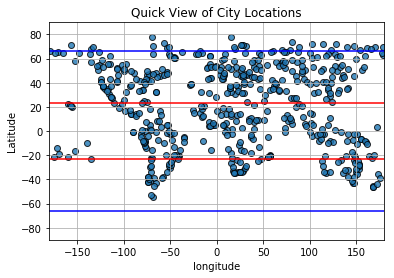
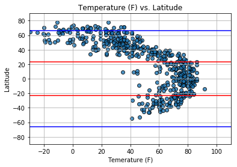
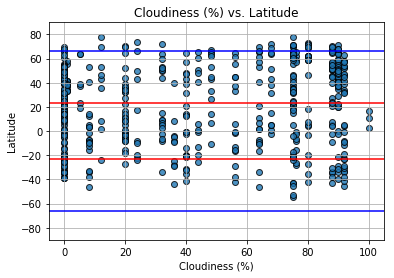
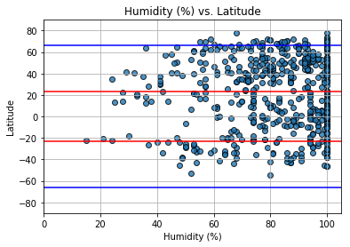
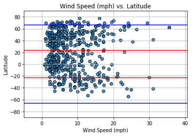

# Python API Homework 

Observations:

•	There are three climate zones.  When I overlapped them on my charts it helped to visualize the patterns.  The Tropical Zone is 23.5 to -23.5, the Temperate Zone is 23.5 to 66.5 and -23.5 to -66.5, and finally the Polar Zone is 66.5 to 90 and -66.5 to -90.  Temperature is a perfect curve along the line with the highest temperatures along the equator and falling as you head North or South.  So the closer to the equator you are, the warmer the temperature.

•	There is no clustering or pattern of wind speed around the equator.  The data seems to prove out the Coriolis Effect, such that the latitude will impact the direction of the wind, but not the speed of the wind.

•	Cloud cover is strictly an observed event.  The graph is patterned heavily along specific percentages assigned by an observer.  This chart shows that while the latitude does not impact level of cloudiness, the observers bias toward percentages is very strong.


```python
# Dependencies
import random
import json
import requests as req
from citipy import citipy
from key_vault import ow_api_key
import pandas as pd
from random import uniform
import matplotlib.pyplot as plt
import csv
from time import strftime, localtime
```


```python
# set parameters and build partial url for api requests
url = "http://api.openweathermap.org/data/2.5/weather?"
units = "imperial"
query_url = url + ow_api_key + "&units=" + units + "&q="
```


```python
#This section of code sets up the dataframe by randomly selecting lat/lon finding the nearest city and dropping duplicates

city_num = 1500

data_df= {}
data_df=pd.DataFrame(data_df)
data_df["City"]= ' '
data_df["Country"]= ' '
data_df["lat"]= ' '
data_df["lon"]= ' '
data_df["Temp"]= ' '
data_df["Temp_Min"]= ' '
data_df["Temp_Max"]= ' '
data_df["Humidity"] = ' '
data_df["Cloud"] = ' '
data_df["Wind_Speed"]= ' '


for index in range(0, city_num):
    x, y = uniform(-180,180), uniform(-90, 90)
    data_df.set_value(index, "lat", y)
    data_df.set_value(index, "lon", x)
    data_df.set_value(index, "City", citipy.nearest_city(y,x).city_name)
    data_df.set_value(index, "Country", citipy.nearest_city(y,x).country_code)

data_df= data_df.drop_duplicates("City")    
data_df = data_df.reset_index(drop=True)
data_df.head(10)   
```


<div>
<style>
    .dataframe thead tr:only-child th {
        text-align: right;
    }

    .dataframe thead th {
        text-align: left;
    }

    .dataframe tbody tr th {
        vertical-align: top;
    }
</style>
<table border="1" class="dataframe">
  <thead>
    <tr style="text-align: right;">
      <th></th>
      <th>City</th>
      <th>Country</th>
      <th>lat</th>
      <th>lon</th>
      <th>Temp</th>
      <th>Temp_Min</th>
      <th>Temp_Max</th>
      <th>Humidity</th>
      <th>Cloud</th>
      <th>Wind_Speed</th>
    </tr>
  </thead>
  <tbody>
    <tr>
      <th>0</th>
      <td>den helder</td>
      <td>nl</td>
      <td>54.487</td>
      <td>3.75836</td>
      <td>NaN</td>
      <td>NaN</td>
      <td>NaN</td>
      <td>NaN</td>
      <td>NaN</td>
      <td>NaN</td>
    </tr>
    <tr>
      <th>1</th>
      <td>quatre cocos</td>
      <td>mu</td>
      <td>-15.9899</td>
      <td>66.5284</td>
      <td>NaN</td>
      <td>NaN</td>
      <td>NaN</td>
      <td>NaN</td>
      <td>NaN</td>
      <td>NaN</td>
    </tr>
    <tr>
      <th>2</th>
      <td>bengkulu</td>
      <td>id</td>
      <td>-14.9051</td>
      <td>95.2989</td>
      <td>NaN</td>
      <td>NaN</td>
      <td>NaN</td>
      <td>NaN</td>
      <td>NaN</td>
      <td>NaN</td>
    </tr>
    <tr>
      <th>3</th>
      <td>bambanglipuro</td>
      <td>id</td>
      <td>-11.6079</td>
      <td>110.341</td>
      <td>NaN</td>
      <td>NaN</td>
      <td>NaN</td>
      <td>NaN</td>
      <td>NaN</td>
      <td>NaN</td>
    </tr>
    <tr>
      <th>4</th>
      <td>ushuaia</td>
      <td>ar</td>
      <td>-61.9434</td>
      <td>-39.8308</td>
      <td>NaN</td>
      <td>NaN</td>
      <td>NaN</td>
      <td>NaN</td>
      <td>NaN</td>
      <td>NaN</td>
    </tr>
    <tr>
      <th>5</th>
      <td>rikitea</td>
      <td>pf</td>
      <td>-33.1008</td>
      <td>-105.159</td>
      <td>NaN</td>
      <td>NaN</td>
      <td>NaN</td>
      <td>NaN</td>
      <td>NaN</td>
      <td>NaN</td>
    </tr>
    <tr>
      <th>6</th>
      <td>nagato</td>
      <td>jp</td>
      <td>36.1132</td>
      <td>130.448</td>
      <td>NaN</td>
      <td>NaN</td>
      <td>NaN</td>
      <td>NaN</td>
      <td>NaN</td>
      <td>NaN</td>
    </tr>
    <tr>
      <th>7</th>
      <td>pisco</td>
      <td>pe</td>
      <td>-20.9697</td>
      <td>-86.8391</td>
      <td>NaN</td>
      <td>NaN</td>
      <td>NaN</td>
      <td>NaN</td>
      <td>NaN</td>
      <td>NaN</td>
    </tr>
    <tr>
      <th>8</th>
      <td>kousseri</td>
      <td>cm</td>
      <td>12.2994</td>
      <td>14.5333</td>
      <td>NaN</td>
      <td>NaN</td>
      <td>NaN</td>
      <td>NaN</td>
      <td>NaN</td>
      <td>NaN</td>
    </tr>
    <tr>
      <th>9</th>
      <td>tulnici</td>
      <td>ro</td>
      <td>46.0147</td>
      <td>26.5481</td>
      <td>NaN</td>
      <td>NaN</td>
      <td>NaN</td>
      <td>NaN</td>
      <td>NaN</td>
      <td>NaN</td>
    </tr>
  </tbody>
</table>
</div>


```python
#This section of code executes the api requests from open weather. For all of the cities, it will replace the 
#estimated lat/lon with actual lat/lon and load the data into the dataframe.  lastly, it drops cities that are
#not in open weather.
print("API pull started at :" + strftime("%a, %d %b %Y %H:%M:%S ", localtime()))
weather_data = []
for index in range (0, len(data_df["City"])):
    weather_data= req.get(query_url + data_df.iloc[index,0] + ',' + data_df.iloc[index,1]).json()
    print("Now retrieving " + data_df.iloc[index,0] +", " + " city # " + str(index) )
    try:
        data_df.set_value(index, "lat",weather_data['coord']['lat'])
        data_df.set_value(index, "lon",weather_data['coord']['lon'])
        data_df.set_value(index, "Temp",weather_data['main']['temp'])
        data_df.set_value(index, "Humidity",weather_data['main']['humidity'])
        data_df.set_value(index, "Temp_Min",weather_data['main']['temp_min'])
        data_df.set_value(index, "Temp_Max",weather_data['main']['temp_max'])
        data_df.set_value(index, "Wind_Speed",weather_data['wind']['speed'])
        data_df.set_value(index, "Cloud", weather_data['clouds']['all'])
        
    except KeyError: continue
print("API pull ended at :" + strftime("%a, %d %b %Y %H:%M:%S ", localtime()))        
```

    API pull started at :Thu, 16 Nov 2017 17:22:41 
    Now retrieving den helder,  city # 0
    Now retrieving quatre cocos,  city # 1
    Now retrieving bengkulu,  city # 2
    Now retrieving bambanglipuro,  city # 3
    Now retrieving ushuaia,  city # 4
    Now retrieving rikitea,  city # 5
    Now retrieving nagato,  city # 6
    Now retrieving pisco,  city # 7
    Now retrieving kousseri,  city # 8
    Now retrieving tulnici,  city # 9
    Now retrieving barrow,  city # 10
    Now retrieving luderitz,  city # 11
    Now retrieving salalah,  city # 12
    Now retrieving ondangwa,  city # 13
    Now retrieving sumter,  city # 14
    Now retrieving brisbane,  city # 15
    Now retrieving oktyabrskoye,  city # 16
    Now retrieving amderma,  city # 17
    Now retrieving poum,  city # 18
    Now retrieving north bend,  city # 19
    Now retrieving longyearbyen,  city # 20
    Now retrieving qaanaaq,  city # 21
    Now retrieving plettenberg bay,  city # 22
    Now retrieving baiao,  city # 23
    Now retrieving saldanha,  city # 24
    Now retrieving tocopilla,  city # 25
    Now retrieving kendrapara,  city # 26
    Now retrieving ouesso,  city # 27
    Now retrieving nanakuli,  city # 28
    Now retrieving upernavik,  city # 29
    Now retrieving hambantota,  city # 30
    Now retrieving tura,  city # 31
    Now retrieving shirokiy,  city # 32
    Now retrieving college,  city # 33
    Now retrieving vao,  city # 34
    Now retrieving arman,  city # 35
    Now retrieving vaini,  city # 36
    Now retrieving umzimvubu,  city # 37
    Now retrieving taolanaro,  city # 38
    Now retrieving narsaq,  city # 39
    Now retrieving bolobo,  city # 40
    Now retrieving prainha,  city # 41
    Now retrieving punta arenas,  city # 42
    Now retrieving srednekolymsk,  city # 43
    Now retrieving malwan,  city # 44
    Now retrieving severo-kurilsk,  city # 45
    Now retrieving mataura,  city # 46
    Now retrieving bluff,  city # 47
    Now retrieving carnarvon,  city # 48
    Now retrieving karratha,  city # 49
    Now retrieving tabas,  city # 50
    Now retrieving ribeira grande,  city # 51
    Now retrieving albany,  city # 52
    Now retrieving ishim,  city # 53
    Now retrieving puerto ayora,  city # 54
    Now retrieving lithgow,  city # 55
    Now retrieving jamestown,  city # 56
    Now retrieving east london,  city # 57
    Now retrieving caraquet,  city # 58
    Now retrieving hede,  city # 59
    Now retrieving dikson,  city # 60
    Now retrieving kavieng,  city # 61
    Now retrieving lorengau,  city # 62
    Now retrieving dakar,  city # 63
    Now retrieving tsihombe,  city # 64
    Now retrieving salto de pirapora,  city # 65
    Now retrieving busselton,  city # 66
    Now retrieving saint-philippe,  city # 67
    Now retrieving fortuna,  city # 68
    Now retrieving bilma,  city # 69
    Now retrieving padang,  city # 70
    Now retrieving zhangjiakou,  city # 71
    Now retrieving shiraz,  city # 72
    Now retrieving port elizabeth,  city # 73
    Now retrieving georgetown,  city # 74
    Now retrieving hilo,  city # 75
    Now retrieving egvekinot,  city # 76
    Now retrieving varkkallai,  city # 77
    Now retrieving new norfolk,  city # 78
    Now retrieving ahipara,  city # 79
    Now retrieving namibe,  city # 80
    Now retrieving interlaken,  city # 81
    Now retrieving hargeysa,  city # 82
    Now retrieving sa kaeo,  city # 83
    Now retrieving tiksi,  city # 84
    Now retrieving broken hill,  city # 85
    Now retrieving merauke,  city # 86
    Now retrieving lavrentiya,  city # 87
    Now retrieving sangar,  city # 88
    Now retrieving ponta do sol,  city # 89
    Now retrieving adre,  city # 90
    Now retrieving airai,  city # 91
    Now retrieving victoria,  city # 92
    Now retrieving bredasdorp,  city # 93
    Now retrieving nome,  city # 94
    Now retrieving port alfred,  city # 95
    Now retrieving clyde river,  city # 96
    Now retrieving sainte-maxime,  city # 97
    Now retrieving bubaque,  city # 98
    Now retrieving kruisfontein,  city # 99
    Now retrieving hoshcha,  city # 100
    Now retrieving iqaluit,  city # 101
    Now retrieving vila velha,  city # 102
    Now retrieving mar del plata,  city # 103
    Now retrieving touros,  city # 104
    Now retrieving isangel,  city # 105
    Now retrieving cape town,  city # 106
    Now retrieving arlit,  city # 107
    Now retrieving hasaki,  city # 108
    Now retrieving khatanga,  city # 109
    Now retrieving leshukonskoye,  city # 110
    Now retrieving gao,  city # 111
    Now retrieving vardo,  city # 112
    Now retrieving hermanus,  city # 113
    Now retrieving praia da vitoria,  city # 114
    Now retrieving labelle,  city # 115
    Now retrieving aklavik,  city # 116
    Now retrieving provideniya,  city # 117
    Now retrieving ajdabiya,  city # 118
    Now retrieving asosa,  city # 119
    Now retrieving humaita,  city # 120
    Now retrieving visby,  city # 121
    Now retrieving hobart,  city # 122
    Now retrieving vanavara,  city # 123
    Now retrieving moose factory,  city # 124
    Now retrieving pervomayskiy,  city # 125
    Now retrieving mys shmidta,  city # 126
    Now retrieving bandar maharani,  city # 127
    Now retrieving emerald,  city # 128
    Now retrieving nueva loja,  city # 129
    Now retrieving toliary,  city # 130
    Now retrieving torbay,  city # 131
    Now retrieving thunder bay,  city # 132
    Now retrieving belur,  city # 133
    Now retrieving bethel,  city # 134
    Now retrieving shannon,  city # 135
    Now retrieving te anau,  city # 136
    Now retrieving mackay,  city # 137
    Now retrieving ciechanow,  city # 138
    Now retrieving uruzgan,  city # 139
    Now retrieving myrtle beach,  city # 140
    Now retrieving nuuk,  city # 141
    Now retrieving zhuanghe,  city # 142
    Now retrieving saint-francois,  city # 143
    Now retrieving goure,  city # 144
    Now retrieving cidreira,  city # 145
    Now retrieving kilinochchi,  city # 146
    Now retrieving avarua,  city # 147
    Now retrieving luban,  city # 148
    Now retrieving sao joao da barra,  city # 149
    Now retrieving kapaa,  city # 150
    Now retrieving cayenne,  city # 151
    Now retrieving de-kastri,  city # 152
    Now retrieving lebu,  city # 153
    Now retrieving natal,  city # 154
    Now retrieving katsuura,  city # 155
    Now retrieving chengde,  city # 156
    Now retrieving houston,  city # 157
    Now retrieving port hardy,  city # 158
    Now retrieving atuona,  city # 159
    Now retrieving namwala,  city # 160
    Now retrieving tasiilaq,  city # 161
    Now retrieving castro,  city # 162
    Now retrieving thompson,  city # 163
    Now retrieving chuy,  city # 164
    Now retrieving mount isa,  city # 165
    Now retrieving kitimat,  city # 166
    Now retrieving biak,  city # 167
    Now retrieving moulins,  city # 168
    Now retrieving laiagam,  city # 169
    Now retrieving gryazovets,  city # 170
    Now retrieving bonavista,  city # 171
    Now retrieving butaritari,  city # 172
    Now retrieving alice springs,  city # 173
    Now retrieving bolshoy tsaryn,  city # 174
    Now retrieving faanui,  city # 175
    Now retrieving palabuhanratu,  city # 176
    Now retrieving muana,  city # 177
    Now retrieving hithadhoo,  city # 178
    Now retrieving langham,  city # 179
    Now retrieving gursahaiganj,  city # 180
    Now retrieving nantucket,  city # 181
    Now retrieving tazovskiy,  city # 182
    Now retrieving yauya,  city # 183
    Now retrieving slave lake,  city # 184
    Now retrieving kodiak,  city # 185
    Now retrieving nikolskoye,  city # 186
    Now retrieving bowen,  city # 187
    Now retrieving nagapattinam,  city # 188
    Now retrieving cherskiy,  city # 189
    Now retrieving maumere,  city # 190
    Now retrieving yulara,  city # 191
    Now retrieving misratah,  city # 192
    Now retrieving port lincoln,  city # 193
    Now retrieving mayo,  city # 194
    Now retrieving geraldton,  city # 195
    Now retrieving dingli,  city # 196
    Now retrieving mitzic,  city # 197
    Now retrieving vestmanna,  city # 198
    Now retrieving norman wells,  city # 199
    Now retrieving mahebourg,  city # 200
    Now retrieving vanimo,  city # 201
    Now retrieving akdepe,  city # 202
    Now retrieving syracuse,  city # 203
    Now retrieving high prairie,  city # 204
    Now retrieving avon lake,  city # 205
    Now retrieving makkaveyevo,  city # 206
    Now retrieving bekhtery,  city # 207
    Now retrieving coleraine,  city # 208
    Now retrieving ngukurr,  city # 209
    Now retrieving tuktoyaktuk,  city # 210
    Now retrieving steamboat springs,  city # 211
    Now retrieving hukuntsi,  city # 212
    Now retrieving zhigansk,  city # 213
    Now retrieving arraial do cabo,  city # 214
    Now retrieving cabo san lucas,  city # 215
    Now retrieving amuntai,  city # 216
    Now retrieving sentyabrskiy,  city # 217
    Now retrieving barentsburg,  city # 218
    Now retrieving novikovo,  city # 219
    Now retrieving wuda,  city # 220
    Now retrieving karakendzha,  city # 221
    Now retrieving chagda,  city # 222
    Now retrieving makakilo city,  city # 223
    Now retrieving uchiza,  city # 224
    Now retrieving saskylakh,  city # 225
    Now retrieving yellowknife,  city # 226
    Now retrieving springbok,  city # 227
    Now retrieving kibaya,  city # 228
    Now retrieving ulladulla,  city # 229
    Now retrieving pacific grove,  city # 230
    Now retrieving kieta,  city # 231
    Now retrieving yar-sale,  city # 232
    Now retrieving san patricio,  city # 233
    Now retrieving port blair,  city # 234
    Now retrieving saryshagan,  city # 235
    Now retrieving grindavik,  city # 236
    Now retrieving bathsheba,  city # 237
    Now retrieving macapa,  city # 238
    Now retrieving machali,  city # 239
    Now retrieving acapulco,  city # 240
    Now retrieving yerbogachen,  city # 241
    Now retrieving ginir,  city # 242
    Now retrieving phonhong,  city # 243
    Now retrieving simav,  city # 244
    Now retrieving lufilufi,  city # 245
    Now retrieving pevek,  city # 246
    Now retrieving springfield,  city # 247
    Now retrieving la tuque,  city # 248
    Now retrieving rajauri,  city # 249
    Now retrieving attawapiskat,  city # 250
    Now retrieving veranopolis,  city # 251
    Now retrieving banda aceh,  city # 252
    Now retrieving kavaratti,  city # 253
    Now retrieving marrakesh,  city # 254
    Now retrieving sao domingos,  city # 255
    Now retrieving port hawkesbury,  city # 256
    Now retrieving santa luzia,  city # 257
    Now retrieving champerico,  city # 258
    Now retrieving turukhansk,  city # 259
    Now retrieving kaitangata,  city # 260
    Now retrieving goderich,  city # 261
    Now retrieving verkhnyaya inta,  city # 262
    Now retrieving tuymazy,  city # 263
    Now retrieving jalu,  city # 264
    Now retrieving carberry,  city # 265
    Now retrieving sokoni,  city # 266
    Now retrieving san quintin,  city # 267
    Now retrieving wittstock,  city # 268
    Now retrieving saint-augustin,  city # 269
    Now retrieving fort nelson,  city # 270
    Now retrieving sioux lookout,  city # 271
    Now retrieving nanortalik,  city # 272
    Now retrieving payo,  city # 273
    Now retrieving asau,  city # 274
    Now retrieving el faiyum,  city # 275
    Now retrieving maharajganj,  city # 276
    Now retrieving san cristobal,  city # 277
    Now retrieving mecca,  city # 278
    Now retrieving souillac,  city # 279
    Now retrieving lompoc,  city # 280
    Now retrieving saint george,  city # 281
    Now retrieving stolin,  city # 282
    Now retrieving nalut,  city # 283
    Now retrieving harper,  city # 284
    Now retrieving mwinilunga,  city # 285
    Now retrieving lima,  city # 286
    Now retrieving faya,  city # 287
    Now retrieving fort saint john,  city # 288
    Now retrieving komsomolskiy,  city # 289
    Now retrieving lagoa,  city # 290
    Now retrieving tokur,  city # 291
    Now retrieving nikolsk,  city # 292
    Now retrieving ndele,  city # 293
    Now retrieving klaksvik,  city # 294
    Now retrieving baijiantan,  city # 295
    Now retrieving miles city,  city # 296
    Now retrieving lewistown,  city # 297
    Now retrieving husavik,  city # 298
    Now retrieving bambous virieux,  city # 299
    Now retrieving petropavlovsk-kamchatskiy,  city # 300
    Now retrieving machico,  city # 301
    Now retrieving zurrieq,  city # 302
    Now retrieving shar,  city # 303
    Now retrieving rincon,  city # 304
    Now retrieving kaseda,  city # 305
    Now retrieving samarai,  city # 306
    Now retrieving uglich,  city # 307
    Now retrieving ocos,  city # 308
    Now retrieving vostok,  city # 309
    Now retrieving kurilsk,  city # 310
    Now retrieving tumannyy,  city # 311
    Now retrieving pangody,  city # 312
    Now retrieving nouakchott,  city # 313
    Now retrieving araguaina,  city # 314
    Now retrieving satitoa,  city # 315
    Now retrieving illoqqortoormiut,  city # 316
    Now retrieving murgab,  city # 317
    Now retrieving akyab,  city # 318
    Now retrieving el rusio,  city # 319
    Now retrieving panguna,  city # 320
    Now retrieving calama,  city # 321
    Now retrieving barstow,  city # 322
    Now retrieving sokoto,  city # 323
    Now retrieving ninghai,  city # 324
    Now retrieving korla,  city # 325
    Now retrieving asopos,  city # 326
    Now retrieving half moon bay,  city # 327
    Now retrieving nova odesa,  city # 328
    Now retrieving hami,  city # 329
    Now retrieving chokurdakh,  city # 330
    Now retrieving codrington,  city # 331
    Now retrieving general roca,  city # 332
    Now retrieving vaitupu,  city # 333
    Now retrieving pochutla,  city # 334
    Now retrieving rawlins,  city # 335
    Now retrieving alexandria,  city # 336
    Now retrieving portland,  city # 337
    Now retrieving synya,  city # 338
    Now retrieving beringovskiy,  city # 339
    Now retrieving vila,  city # 340
    Now retrieving miraflores,  city # 341
    Now retrieving evensk,  city # 342
    Now retrieving hamilton,  city # 343
    Now retrieving nizhneyansk,  city # 344
    Now retrieving deputatskiy,  city # 345
    Now retrieving huarmey,  city # 346
    Now retrieving hofn,  city # 347
    Now retrieving kologriv,  city # 348
    Now retrieving pokrovsk,  city # 349
    Now retrieving gabu,  city # 350
    Now retrieving necochea,  city # 351
    Now retrieving lata,  city # 352
    Now retrieving bonoua,  city # 353
    Now retrieving sampit,  city # 354
    Now retrieving puri,  city # 355
    Now retrieving kamenka,  city # 356
    Now retrieving cervo,  city # 357
    Now retrieving olga,  city # 358
    Now retrieving rawson,  city # 359
    Now retrieving belison,  city # 360
    Now retrieving muskegon,  city # 361
    Now retrieving bandarbeyla,  city # 362
    Now retrieving novouzensk,  city # 363
    Now retrieving harindanga,  city # 364
    Now retrieving camapua,  city # 365
    Now retrieving okitipupa,  city # 366
    Now retrieving marasu,  city # 367
    Now retrieving bure,  city # 368
    Now retrieving yumen,  city # 369
    Now retrieving pedernales,  city # 370
    Now retrieving dingle,  city # 371
    Now retrieving corinto,  city # 372
    Now retrieving guerrero negro,  city # 373
    Now retrieving halifax,  city # 374
    Now retrieving suceveni,  city # 375
    Now retrieving sai buri,  city # 376
    Now retrieving flin flon,  city # 377
    Now retrieving zhucheng,  city # 378
    Now retrieving qui nhon,  city # 379
    Now retrieving wau,  city # 380
    Now retrieving bambui,  city # 381
    Now retrieving salinas,  city # 382
    Now retrieving grand river south east,  city # 383
    Now retrieving tabiauea,  city # 384
    Now retrieving qianan,  city # 385
    Now retrieving hvolsvollur,  city # 386
    Now retrieving margate,  city # 387
    Now retrieving chumikan,  city # 388
    Now retrieving angoche,  city # 389
    Now retrieving grand-lahou,  city # 390
    Now retrieving sayat,  city # 391
    Now retrieving cedar city,  city # 392
    Now retrieving ciudad bolivar,  city # 393
    Now retrieving wicklow,  city # 394
    Now retrieving talnakh,  city # 395
    Now retrieving westpunt,  city # 396
    Now retrieving licata,  city # 397
    Now retrieving adrar,  city # 398
    Now retrieving cleburne,  city # 399
    Now retrieving port macquarie,  city # 400
    Now retrieving sanming,  city # 401
    Now retrieving oron,  city # 402
    Now retrieving kytlym,  city # 403
    Now retrieving tecoanapa,  city # 404
    Now retrieving turangi,  city # 405
    Now retrieving aswan,  city # 406
    Now retrieving erzin,  city # 407
    Now retrieving sobolevo,  city # 408
    Now retrieving hovd,  city # 409
    Now retrieving loreto,  city # 410
    Now retrieving zeya,  city # 411
    Now retrieving churapcha,  city # 412
    Now retrieving eureka,  city # 413
    Now retrieving kyra,  city # 414
    Now retrieving milledgeville,  city # 415
    Now retrieving aasiaat,  city # 416
    Now retrieving javanrud,  city # 417
    Now retrieving paita,  city # 418
    Now retrieving farafangana,  city # 419
    Now retrieving ulaangom,  city # 420
    Now retrieving belmonte,  city # 421
    Now retrieving comodoro rivadavia,  city # 422
    Now retrieving laguna,  city # 423
    Now retrieving avera,  city # 424
    Now retrieving lola,  city # 425
    Now retrieving asino,  city # 426
    Now retrieving sidi ali,  city # 427
    Now retrieving belushya guba,  city # 428
    Now retrieving windhoek,  city # 429
    Now retrieving quesnel,  city # 430
    Now retrieving aksu,  city # 431
    Now retrieving manggar,  city # 432
    Now retrieving burnie,  city # 433
    Now retrieving karauzyak,  city # 434
    Now retrieving mareeba,  city # 435
    Now retrieving ternate,  city # 436
    Now retrieving paka,  city # 437
    Now retrieving edmundston,  city # 438
    Now retrieving meulaboh,  city # 439
    Now retrieving kiruna,  city # 440
    Now retrieving outlook,  city # 441
    Now retrieving san carlos de bariloche,  city # 442
    Now retrieving carutapera,  city # 443
    Now retrieving banmo,  city # 444
    Now retrieving devavanya,  city # 445
    Now retrieving alofi,  city # 446
    Now retrieving wum,  city # 447
    Now retrieving tiruchchirappalli,  city # 448
    Now retrieving darnah,  city # 449
    Now retrieving labuhan,  city # 450
    Now retrieving sapa,  city # 451
    Now retrieving artyk,  city # 452
    Now retrieving teknaf,  city # 453
    Now retrieving ancud,  city # 454
    Now retrieving alihe,  city # 455
    Now retrieving kjollefjord,  city # 456
    Now retrieving zhangye,  city # 457
    Now retrieving sitka,  city # 458
    Now retrieving sistranda,  city # 459
    Now retrieving atambua,  city # 460
    Now retrieving cape coast,  city # 461
    Now retrieving cockburn town,  city # 462
    Now retrieving esperance,  city # 463
    Now retrieving hailey,  city # 464
    Now retrieving baykalovo,  city # 465
    Now retrieving staryy nadym,  city # 466
    Now retrieving chimbote,  city # 467
    Now retrieving coquimbo,  city # 468
    Now retrieving capinzal,  city # 469
    Now retrieving rozkishne,  city # 470
    Now retrieving la seyne-sur-mer,  city # 471
    Now retrieving gambela,  city # 472
    Now retrieving scarborough,  city # 473
    Now retrieving sao filipe,  city # 474
    Now retrieving auki,  city # 475
    Now retrieving dekoa,  city # 476
    Now retrieving paamiut,  city # 477
    Now retrieving sault sainte marie,  city # 478
    Now retrieving lixourion,  city # 479
    Now retrieving chicama,  city # 480
    Now retrieving orocue,  city # 481
    Now retrieving yeniseysk,  city # 482
    Now retrieving mehamn,  city # 483
    Now retrieving sinkat,  city # 484
    Now retrieving sergeyevka,  city # 485
    Now retrieving isiro,  city # 486
    Now retrieving divnomorskoye,  city # 487
    Now retrieving kamina,  city # 488
    Now retrieving moshi,  city # 489
    Now retrieving samalaeulu,  city # 490
    Now retrieving andros town,  city # 491
    Now retrieving atar,  city # 492
    Now retrieving samusu,  city # 493
    Now retrieving muzquiz,  city # 494
    Now retrieving albertville,  city # 495
    Now retrieving roma,  city # 496
    Now retrieving lakes entrance,  city # 497
    Now retrieving ilulissat,  city # 498
    Now retrieving vestmannaeyjar,  city # 499
    Now retrieving karoi,  city # 500
    Now retrieving sterling,  city # 501
    Now retrieving emba,  city # 502
    Now retrieving ishigaki,  city # 503
    Now retrieving dzaoudzi,  city # 504
    Now retrieving tuatapere,  city # 505
    Now retrieving wajir,  city # 506
    Now retrieving general bravo,  city # 507
    Now retrieving torbat-e jam,  city # 508
    Now retrieving nouadhibou,  city # 509
    Now retrieving santa isabel do rio negro,  city # 510
    Now retrieving vallenar,  city # 511
    Now retrieving bestobe,  city # 512
    Now retrieving jijiga,  city # 513
    Now retrieving upata,  city # 514
    Now retrieving loncoche,  city # 515
    Now retrieving verkhnevilyuysk,  city # 516
    Now retrieving bilibino,  city # 517
    Now retrieving kahului,  city # 518
    Now retrieving corralillo,  city # 519
    Now retrieving ust-ishim,  city # 520
    Now retrieving lolua,  city # 521
    Now retrieving aviles,  city # 522
    Now retrieving belyy yar,  city # 523
    Now retrieving ituango,  city # 524
    Now retrieving talas,  city # 525
    Now retrieving byron bay,  city # 526
    Now retrieving saint-pierre,  city # 527
    Now retrieving manokwari,  city # 528
    Now retrieving kostomuksha,  city # 529
    Now retrieving anadyr,  city # 530
    Now retrieving alta floresta,  city # 531
    Now retrieving chai nat,  city # 532
    Now retrieving carlsbad,  city # 533
    Now retrieving terney,  city # 534
    Now retrieving gunnedah,  city # 535
    Now retrieving bundaberg,  city # 536
    Now retrieving gold coast,  city # 537
    Now retrieving port-gentil,  city # 538
    Now retrieving waingapu,  city # 539
    Now retrieving honningsvag,  city # 540
    Now retrieving suntar,  city # 541
    Now retrieving bokhan,  city # 542
    Now retrieving pangkalanbuun,  city # 543
    Now retrieving iquitos,  city # 544
    Now retrieving kutum,  city # 545
    Now retrieving kamenskoye,  city # 546
    Now retrieving buala,  city # 547
    Now retrieving muli,  city # 548
    Now retrieving swadlincote,  city # 549
    Now retrieving banepa,  city # 550
    Now retrieving blagoyevo,  city # 551
    Now retrieving mullaitivu,  city # 552
    Now retrieving tabou,  city # 553
    Now retrieving jiangyou,  city # 554
    Now retrieving beloha,  city # 555
    Now retrieving mmabatho,  city # 556
    Now retrieving daoukro,  city # 557
    Now retrieving richards bay,  city # 558
    Now retrieving panjab,  city # 559
    Now retrieving iralaya,  city # 560
    Now retrieving bay roberts,  city # 561
    Now retrieving christchurch,  city # 562
    Now retrieving varhaug,  city # 563
    Now retrieving ankang,  city # 564
    Now retrieving jiuquan,  city # 565
    Now retrieving aba,  city # 566
    Now retrieving port augusta,  city # 567
    Now retrieving seydi,  city # 568
    Now retrieving antofagasta,  city # 569
    Now retrieving japura,  city # 570
    Now retrieving huilong,  city # 571
    Now retrieving poltavka,  city # 572
    Now retrieving dauphin,  city # 573
    Now retrieving pontal do parana,  city # 574
    Now retrieving leningradskiy,  city # 575
    Now retrieving canete,  city # 576
    Now retrieving muisne,  city # 577
    Now retrieving kargasok,  city # 578
    Now retrieving znamenskoye,  city # 579
    Now retrieving rolla,  city # 580
    Now retrieving maragogi,  city # 581
    Now retrieving mitu,  city # 582
    Now retrieving amot,  city # 583
    Now retrieving qaqortoq,  city # 584
    Now retrieving huimanguillo,  city # 585
    Now retrieving santa rosalia,  city # 586
    Now retrieving shchelyayur,  city # 587
    Now retrieving san luis,  city # 588
    Now retrieving sinnamary,  city # 589
    Now retrieving ambodifototra,  city # 590
    Now retrieving saint-joseph,  city # 591
    Now retrieving quelimane,  city # 592
    Now retrieving istanbul,  city # 593
    Now retrieving kirakira,  city # 594
    Now retrieving kralendijk,  city # 595
    Now retrieving storsteinnes,  city # 596
    Now retrieving mayumba,  city # 597
    Now retrieving marsa matruh,  city # 598
    Now retrieving giaginskaya,  city # 599
    Now retrieving constitucion,  city # 600
    Now retrieving kapit,  city # 601
    Now retrieving marcona,  city # 602
    Now retrieving ust-kamchatsk,  city # 603
    Now retrieving umm bab,  city # 604
    Now retrieving aulnoye-aymeries,  city # 605
    Now retrieving biberach,  city # 606
    Now retrieving putina,  city # 607
    Now retrieving itarema,  city # 608
    Now retrieving pacifica,  city # 609
    Now retrieving chapais,  city # 610
    Now retrieving bonfim,  city # 611
    Now retrieving muros,  city # 612
    Now retrieving mao,  city # 613
    Now retrieving zachepylivka,  city # 614
    API pull ended at :Thu, 16 Nov 2017 17:26:46 
    


```python
#final data cleanup, dropping Cities not in the Weather database and resetting the index
data_df= data_df.dropna()
data_df = data_df.reset_index(drop=True)
```


```python
#save the DataFrame to a csv file
data_df.to_csv("Global_Weather_Data.csv", encoding= 'utf-8', index = False)
data_df
```


<div>
<style>
    .dataframe thead tr:only-child th {
        text-align: right;
    }

    .dataframe thead th {
        text-align: left;
    }

    .dataframe tbody tr th {
        vertical-align: top;
    }
</style>
<table border="1" class="dataframe">
  <thead>
    <tr style="text-align: right;">
      <th></th>
      <th>City</th>
      <th>Country</th>
      <th>lat</th>
      <th>lon</th>
      <th>Temp</th>
      <th>Temp_Min</th>
      <th>Temp_Max</th>
      <th>Humidity</th>
      <th>Cloud</th>
      <th>Wind_Speed</th>
    </tr>
  </thead>
  <tbody>
    <tr>
      <th>0</th>
      <td>fulton</td>
      <td>us</td>
      <td>38.85</td>
      <td>-91.95</td>
      <td>39.07</td>
      <td>37.4</td>
      <td>41</td>
      <td>60</td>
      <td>1</td>
      <td>3.36</td>
    </tr>
    <tr>
      <th>1</th>
      <td>ushuaia</td>
      <td>ar</td>
      <td>-54.8</td>
      <td>-68.3</td>
      <td>46.4</td>
      <td>46.4</td>
      <td>46.4</td>
      <td>65</td>
      <td>40</td>
      <td>5.82</td>
    </tr>
    <tr>
      <th>2</th>
      <td>albany</td>
      <td>au</td>
      <td>-35.02</td>
      <td>117.89</td>
      <td>68.69</td>
      <td>68.69</td>
      <td>68.69</td>
      <td>79</td>
      <td>48</td>
      <td>12.66</td>
    </tr>
    <tr>
      <th>3</th>
      <td>ust-maya</td>
      <td>ru</td>
      <td>60.42</td>
      <td>134.53</td>
      <td>-24.15</td>
      <td>-24.15</td>
      <td>-24.15</td>
      <td>35</td>
      <td>44</td>
      <td>2.71</td>
    </tr>
    <tr>
      <th>4</th>
      <td>saint-philippe</td>
      <td>re</td>
      <td>-21.36</td>
      <td>55.77</td>
      <td>75.09</td>
      <td>73.4</td>
      <td>77</td>
      <td>78</td>
      <td>40</td>
      <td>3.36</td>
    </tr>
    <tr>
      <th>5</th>
      <td>barrow</td>
      <td>us</td>
      <td>71.29</td>
      <td>-156.79</td>
      <td>15.8</td>
      <td>15.8</td>
      <td>15.8</td>
      <td>92</td>
      <td>90</td>
      <td>16.11</td>
    </tr>
    <tr>
      <th>6</th>
      <td>hobart</td>
      <td>au</td>
      <td>-42.88</td>
      <td>147.33</td>
      <td>55.4</td>
      <td>55.4</td>
      <td>55.4</td>
      <td>93</td>
      <td>75</td>
      <td>5.82</td>
    </tr>
    <tr>
      <th>7</th>
      <td>grindavik</td>
      <td>is</td>
      <td>63.84</td>
      <td>-22.43</td>
      <td>34.65</td>
      <td>33.8</td>
      <td>35.6</td>
      <td>59</td>
      <td>75</td>
      <td>14.99</td>
    </tr>
    <tr>
      <th>8</th>
      <td>rikitea</td>
      <td>pf</td>
      <td>-23.12</td>
      <td>-134.97</td>
      <td>75.53</td>
      <td>75.53</td>
      <td>75.53</td>
      <td>100</td>
      <td>20</td>
      <td>7.52</td>
    </tr>
    <tr>
      <th>9</th>
      <td>hasaki</td>
      <td>jp</td>
      <td>35.73</td>
      <td>140.83</td>
      <td>40.75</td>
      <td>37.4</td>
      <td>44.6</td>
      <td>70</td>
      <td>75</td>
      <td>11.41</td>
    </tr>
    <tr>
      <th>10</th>
      <td>buarcos</td>
      <td>pt</td>
      <td>40.17</td>
      <td>-8.88</td>
      <td>60.8</td>
      <td>60.8</td>
      <td>60.8</td>
      <td>51</td>
      <td>0</td>
      <td>9.17</td>
    </tr>
    <tr>
      <th>11</th>
      <td>roald</td>
      <td>no</td>
      <td>62.58</td>
      <td>6.13</td>
      <td>41.58</td>
      <td>39.2</td>
      <td>42.8</td>
      <td>87</td>
      <td>75</td>
      <td>16.11</td>
    </tr>
    <tr>
      <th>12</th>
      <td>chuy</td>
      <td>uy</td>
      <td>-33.7</td>
      <td>-53.46</td>
      <td>64.1</td>
      <td>64.1</td>
      <td>64.1</td>
      <td>82</td>
      <td>76</td>
      <td>15.57</td>
    </tr>
    <tr>
      <th>13</th>
      <td>hithadhoo</td>
      <td>mv</td>
      <td>-0.6</td>
      <td>73.08</td>
      <td>83</td>
      <td>83</td>
      <td>83</td>
      <td>100</td>
      <td>92</td>
      <td>13.22</td>
    </tr>
    <tr>
      <th>14</th>
      <td>butaritari</td>
      <td>ki</td>
      <td>3.07</td>
      <td>172.79</td>
      <td>82.37</td>
      <td>82.37</td>
      <td>82.37</td>
      <td>100</td>
      <td>12</td>
      <td>8.08</td>
    </tr>
    <tr>
      <th>15</th>
      <td>atuona</td>
      <td>pf</td>
      <td>-9.8</td>
      <td>-139.03</td>
      <td>79.49</td>
      <td>79.49</td>
      <td>79.49</td>
      <td>100</td>
      <td>0</td>
      <td>17.02</td>
    </tr>
    <tr>
      <th>16</th>
      <td>willowmore</td>
      <td>za</td>
      <td>-33.29</td>
      <td>23.49</td>
      <td>47.18</td>
      <td>47.18</td>
      <td>47.18</td>
      <td>83</td>
      <td>56</td>
      <td>5.61</td>
    </tr>
    <tr>
      <th>17</th>
      <td>zhigansk</td>
      <td>ru</td>
      <td>66.77</td>
      <td>123.37</td>
      <td>-8.4</td>
      <td>-8.4</td>
      <td>-8.4</td>
      <td>81</td>
      <td>68</td>
      <td>0.81</td>
    </tr>
    <tr>
      <th>18</th>
      <td>busselton</td>
      <td>au</td>
      <td>-33.65</td>
      <td>115.33</td>
      <td>67.43</td>
      <td>67.43</td>
      <td>67.43</td>
      <td>97</td>
      <td>88</td>
      <td>19.48</td>
    </tr>
    <tr>
      <th>19</th>
      <td>mar del plata</td>
      <td>ar</td>
      <td>-38</td>
      <td>-57.56</td>
      <td>66.2</td>
      <td>66.2</td>
      <td>66.2</td>
      <td>48</td>
      <td>40</td>
      <td>10.29</td>
    </tr>
    <tr>
      <th>20</th>
      <td>bredasdorp</td>
      <td>za</td>
      <td>-34.53</td>
      <td>20.04</td>
      <td>66.2</td>
      <td>66.2</td>
      <td>66.2</td>
      <td>52</td>
      <td>0</td>
      <td>12.75</td>
    </tr>
    <tr>
      <th>21</th>
      <td>victoria</td>
      <td>sc</td>
      <td>-4.62</td>
      <td>55.45</td>
      <td>80.6</td>
      <td>80.6</td>
      <td>80.6</td>
      <td>78</td>
      <td>40</td>
      <td>2.24</td>
    </tr>
    <tr>
      <th>22</th>
      <td>jamestown</td>
      <td>sh</td>
      <td>-15.94</td>
      <td>-5.72</td>
      <td>68.73</td>
      <td>68.73</td>
      <td>68.73</td>
      <td>100</td>
      <td>24</td>
      <td>21.83</td>
    </tr>
    <tr>
      <th>23</th>
      <td>hilo</td>
      <td>us</td>
      <td>19.73</td>
      <td>-155.09</td>
      <td>53.94</td>
      <td>46.4</td>
      <td>68</td>
      <td>94</td>
      <td>90</td>
      <td>19.15</td>
    </tr>
    <tr>
      <th>24</th>
      <td>san rafael</td>
      <td>ar</td>
      <td>-34.62</td>
      <td>-68.33</td>
      <td>76.83</td>
      <td>76.83</td>
      <td>76.83</td>
      <td>16</td>
      <td>0</td>
      <td>12.66</td>
    </tr>
    <tr>
      <th>25</th>
      <td>rovinj</td>
      <td>hr</td>
      <td>45.08</td>
      <td>13.64</td>
      <td>48.76</td>
      <td>48.2</td>
      <td>50</td>
      <td>70</td>
      <td>0</td>
      <td>6.93</td>
    </tr>
    <tr>
      <th>26</th>
      <td>cape town</td>
      <td>za</td>
      <td>-33.93</td>
      <td>18.42</td>
      <td>68</td>
      <td>68</td>
      <td>68</td>
      <td>49</td>
      <td>20</td>
      <td>20.8</td>
    </tr>
    <tr>
      <th>27</th>
      <td>bengkulu</td>
      <td>id</td>
      <td>-3.8</td>
      <td>102.27</td>
      <td>80.57</td>
      <td>80.57</td>
      <td>80.57</td>
      <td>100</td>
      <td>36</td>
      <td>2.15</td>
    </tr>
    <tr>
      <th>28</th>
      <td>vila velha</td>
      <td>br</td>
      <td>-20.33</td>
      <td>-40.29</td>
      <td>84.2</td>
      <td>84.2</td>
      <td>84.2</td>
      <td>66</td>
      <td>20</td>
      <td>17.22</td>
    </tr>
    <tr>
      <th>29</th>
      <td>hermanus</td>
      <td>za</td>
      <td>-34.42</td>
      <td>19.23</td>
      <td>58.7</td>
      <td>58.7</td>
      <td>58.7</td>
      <td>63</td>
      <td>8</td>
      <td>8.63</td>
    </tr>
    <tr>
      <th>...</th>
      <td>...</td>
      <td>...</td>
      <td>...</td>
      <td>...</td>
      <td>...</td>
      <td>...</td>
      <td>...</td>
      <td>...</td>
      <td>...</td>
      <td>...</td>
    </tr>
    <tr>
      <th>503</th>
      <td>natchitoches</td>
      <td>us</td>
      <td>31.76</td>
      <td>-93.09</td>
      <td>65.05</td>
      <td>64.4</td>
      <td>66.2</td>
      <td>77</td>
      <td>90</td>
      <td>4.05</td>
    </tr>
    <tr>
      <th>504</th>
      <td>mbala</td>
      <td>zm</td>
      <td>-8.84</td>
      <td>31.37</td>
      <td>69.05</td>
      <td>69.05</td>
      <td>69.05</td>
      <td>47</td>
      <td>0</td>
      <td>4.38</td>
    </tr>
    <tr>
      <th>505</th>
      <td>eureka</td>
      <td>us</td>
      <td>40.8</td>
      <td>-124.16</td>
      <td>50</td>
      <td>50</td>
      <td>50</td>
      <td>87</td>
      <td>90</td>
      <td>6.93</td>
    </tr>
    <tr>
      <th>506</th>
      <td>saint-joseph</td>
      <td>re</td>
      <td>-21.37</td>
      <td>55.62</td>
      <td>75.04</td>
      <td>73.4</td>
      <td>77</td>
      <td>78</td>
      <td>40</td>
      <td>3.36</td>
    </tr>
    <tr>
      <th>507</th>
      <td>ayan</td>
      <td>ru</td>
      <td>56.45</td>
      <td>138.17</td>
      <td>-4.94</td>
      <td>-4.94</td>
      <td>-4.94</td>
      <td>100</td>
      <td>0</td>
      <td>12.55</td>
    </tr>
    <tr>
      <th>508</th>
      <td>ussel</td>
      <td>fr</td>
      <td>45.55</td>
      <td>2.32</td>
      <td>36.2</td>
      <td>36.2</td>
      <td>36.2</td>
      <td>75</td>
      <td>8</td>
      <td>3.71</td>
    </tr>
    <tr>
      <th>509</th>
      <td>belaya gora</td>
      <td>ru</td>
      <td>68.53</td>
      <td>146.42</td>
      <td>4.56</td>
      <td>4.56</td>
      <td>4.56</td>
      <td>78</td>
      <td>80</td>
      <td>11.99</td>
    </tr>
    <tr>
      <th>510</th>
      <td>shiyan</td>
      <td>cn</td>
      <td>32.65</td>
      <td>110.78</td>
      <td>45.11</td>
      <td>45.11</td>
      <td>45.11</td>
      <td>96</td>
      <td>88</td>
      <td>2.26</td>
    </tr>
    <tr>
      <th>511</th>
      <td>laguna</td>
      <td>br</td>
      <td>-28.48</td>
      <td>-48.78</td>
      <td>73.01</td>
      <td>73.01</td>
      <td>73.01</td>
      <td>86</td>
      <td>44</td>
      <td>17.69</td>
    </tr>
    <tr>
      <th>512</th>
      <td>jaisalmer</td>
      <td>in</td>
      <td>26.91</td>
      <td>70.92</td>
      <td>60.14</td>
      <td>60.14</td>
      <td>60.14</td>
      <td>90</td>
      <td>0</td>
      <td>8.63</td>
    </tr>
    <tr>
      <th>513</th>
      <td>diego de almagro</td>
      <td>cl</td>
      <td>-26.37</td>
      <td>-70.05</td>
      <td>72.11</td>
      <td>72.11</td>
      <td>72.11</td>
      <td>67</td>
      <td>0</td>
      <td>3.94</td>
    </tr>
    <tr>
      <th>514</th>
      <td>jumla</td>
      <td>np</td>
      <td>29.27</td>
      <td>82.18</td>
      <td>21.26</td>
      <td>21.26</td>
      <td>21.26</td>
      <td>100</td>
      <td>20</td>
      <td>1.36</td>
    </tr>
    <tr>
      <th>515</th>
      <td>san lorenzo</td>
      <td>ar</td>
      <td>-28.13</td>
      <td>-58.77</td>
      <td>66.08</td>
      <td>66.08</td>
      <td>66.08</td>
      <td>84</td>
      <td>100</td>
      <td>11.65</td>
    </tr>
    <tr>
      <th>516</th>
      <td>alexander city</td>
      <td>us</td>
      <td>32.94</td>
      <td>-85.95</td>
      <td>61.12</td>
      <td>59</td>
      <td>62.6</td>
      <td>72</td>
      <td>90</td>
      <td>3.36</td>
    </tr>
    <tr>
      <th>517</th>
      <td>inhambane</td>
      <td>mz</td>
      <td>-23.86</td>
      <td>35.38</td>
      <td>71.39</td>
      <td>71.39</td>
      <td>71.39</td>
      <td>100</td>
      <td>48</td>
      <td>16.24</td>
    </tr>
    <tr>
      <th>518</th>
      <td>marsh harbour</td>
      <td>bs</td>
      <td>26.54</td>
      <td>-77.06</td>
      <td>78.36</td>
      <td>78.36</td>
      <td>78.36</td>
      <td>100</td>
      <td>48</td>
      <td>17.02</td>
    </tr>
    <tr>
      <th>519</th>
      <td>kurilsk</td>
      <td>ru</td>
      <td>45.23</td>
      <td>147.88</td>
      <td>37.19</td>
      <td>37.19</td>
      <td>37.19</td>
      <td>100</td>
      <td>56</td>
      <td>14.34</td>
    </tr>
    <tr>
      <th>520</th>
      <td>toora-khem</td>
      <td>ru</td>
      <td>52.47</td>
      <td>96.11</td>
      <td>-14.48</td>
      <td>-14.48</td>
      <td>-14.48</td>
      <td>57</td>
      <td>0</td>
      <td>1.7</td>
    </tr>
    <tr>
      <th>521</th>
      <td>ingleside</td>
      <td>us</td>
      <td>27.88</td>
      <td>-97.21</td>
      <td>80.13</td>
      <td>78.8</td>
      <td>80.6</td>
      <td>74</td>
      <td>40</td>
      <td>13.87</td>
    </tr>
    <tr>
      <th>522</th>
      <td>la orilla</td>
      <td>mx</td>
      <td>17.98</td>
      <td>-102.23</td>
      <td>84.44</td>
      <td>84.44</td>
      <td>84.44</td>
      <td>82</td>
      <td>0</td>
      <td>3.38</td>
    </tr>
    <tr>
      <th>523</th>
      <td>marsa matruh</td>
      <td>eg</td>
      <td>31.35</td>
      <td>27.25</td>
      <td>69.8</td>
      <td>69.8</td>
      <td>69.8</td>
      <td>77</td>
      <td>0</td>
      <td>9.17</td>
    </tr>
    <tr>
      <th>524</th>
      <td>rockhampton</td>
      <td>au</td>
      <td>-23.38</td>
      <td>150.5</td>
      <td>66.2</td>
      <td>66.2</td>
      <td>66.2</td>
      <td>82</td>
      <td>40</td>
      <td>6.93</td>
    </tr>
    <tr>
      <th>525</th>
      <td>kaabong</td>
      <td>ug</td>
      <td>3.48</td>
      <td>34.15</td>
      <td>72.2</td>
      <td>72.2</td>
      <td>72.2</td>
      <td>40</td>
      <td>0</td>
      <td>7.4</td>
    </tr>
    <tr>
      <th>526</th>
      <td>zacatepec</td>
      <td>mx</td>
      <td>18.65</td>
      <td>-99.2</td>
      <td>73.4</td>
      <td>73.4</td>
      <td>73.4</td>
      <td>31</td>
      <td>5</td>
      <td>4.7</td>
    </tr>
    <tr>
      <th>527</th>
      <td>leshukonskoye</td>
      <td>ru</td>
      <td>64.9</td>
      <td>45.76</td>
      <td>25.49</td>
      <td>25.49</td>
      <td>25.49</td>
      <td>93</td>
      <td>56</td>
      <td>5.61</td>
    </tr>
    <tr>
      <th>528</th>
      <td>shache</td>
      <td>cn</td>
      <td>38.42</td>
      <td>77.24</td>
      <td>39.75</td>
      <td>39.75</td>
      <td>39.75</td>
      <td>43</td>
      <td>92</td>
      <td>7.18</td>
    </tr>
    <tr>
      <th>529</th>
      <td>boulder city</td>
      <td>us</td>
      <td>35.98</td>
      <td>-114.83</td>
      <td>64.02</td>
      <td>57.2</td>
      <td>69.8</td>
      <td>33</td>
      <td>68</td>
      <td>6.93</td>
    </tr>
    <tr>
      <th>530</th>
      <td>orlik</td>
      <td>ru</td>
      <td>52.52</td>
      <td>99.83</td>
      <td>-25.64</td>
      <td>-25.64</td>
      <td>-25.64</td>
      <td>31</td>
      <td>0</td>
      <td>1.92</td>
    </tr>
    <tr>
      <th>531</th>
      <td>kudahuvadhoo</td>
      <td>mv</td>
      <td>2.67</td>
      <td>72.89</td>
      <td>79.71</td>
      <td>79.71</td>
      <td>79.71</td>
      <td>100</td>
      <td>88</td>
      <td>8.52</td>
    </tr>
    <tr>
      <th>532</th>
      <td>inirida</td>
      <td>co</td>
      <td>3.87</td>
      <td>-67.92</td>
      <td>88.53</td>
      <td>88.53</td>
      <td>88.53</td>
      <td>62</td>
      <td>44</td>
      <td>2.48</td>
    </tr>
  </tbody>
</table>
<p>533 rows × 10 columns</p>
</div>


```python
#scatter plot of the lat/lon in the dataframe to verify distribution, should resemble a map

plt.scatter(data_df["lon"], data_df["lat"],
            edgecolor="black", linewidths=1, marker="o", 
            alpha=0.8, label="Cities")

# Incorporate the other graph properties
plt.title("Quick View of City Locations")
plt.ylabel("Latitude")
plt.xlabel("longitude")
plt.grid(True)
plt.xlim([-180, 180])
plt.ylim([-90, 90])
plt.axhline(y=23.5, c='r')
plt.axhline(y=-23.5, c='r')
plt.axhline(y=66.5, c='b')
plt.axhline(y=-66.5, c='b')

# Save the figure
plt.savefig("Ploting_graph_of_Cities.png")

# Show plot
plt.show()

```





```python
# Build a scatter plot for Temerature ranges along different Latitudes 
plt.scatter(data_df["Temp"], data_df["lat"],
            edgecolor="black", linewidths=1, marker="o", 
            alpha=0.8, label="Latitude")

# Incorporate the other graph properties
plt.title("Temperature (F) vs. Latitude")
plt.ylabel("Latitude")
plt.xlabel("Temerature (F)")
plt.grid(True)
plt.xlim([data_df['Temp'].min() - 5, data_df['Temp'].max() + 5])
plt.xlim([-30, 110])
plt.ylim([-90, 90])
plt.axhline(y=23.5, c='r')
plt.axhline(y=-23.5, c='r')
plt.axhline(y=66.5, c='b')
plt.axhline(y=-66.5, c='b')

# Save the figure
plt.savefig("Temp_Latitude.png")

# Show plot
plt.show()
```





```python
# Build a scatter plot for Cloud cover along different Latitudes 
plt.scatter(data_df["Cloud"], data_df["lat"],
            edgecolor="black", linewidths=1, marker="o", 
            alpha=0.8, label="Latitude")

# Incorporate the other graph properties
plt.title("Cloudiness (%) vs. Latitude")
plt.ylabel("Latitude")
plt.xlabel("Cloudiness (%)")
plt.grid(True)
plt.xlim([-5, 105])
plt.ylim([-90, 90])
plt.axhline(y=23.5, c='r')
plt.axhline(y=-23.5, c='r')
plt.axhline(y=66.5, c='b')
plt.axhline(y=-66.5, c='b')

# Save the figure
plt.savefig("Cloudiness_Latitude.png")

# Show plot
plt.show()

```





```python
# Build a scatter plot for Humidity % along different Latitudes 
plt.scatter(data_df["Humidity"], data_df["lat"],
            edgecolor="black", linewidths=1, marker="o", 
            alpha=0.8, label="Latitude")

# Incorporate the other graph properties
plt.title("Humidity (%) vs. Latitude")
plt.ylabel("Latitude")
plt.xlabel("Humidity (%)")
plt.grid(True)
plt.xlim([0, 105])
plt.ylim([-90, 90])
plt.axhline(y=23.5, c='r')
plt.axhline(y=-23.5, c='r')
plt.axhline(y=66.5, c='b')
plt.axhline(y=-66.5, c='b')
# Save the figure
plt.savefig("Humidity_Latitude.png")

# Show plot
plt.show()


```





```python
# Build a scatter plot for Wind Speeds along different Latitudes 
plt.scatter(data_df["Wind_Speed"], data_df["lat"],
            edgecolor="black", linewidths=1, marker="o", 
            alpha=0.8, label="Latitude")

# Incorporate the other graph properties
plt.title("Wind Speed (mph) vs. Latitude")
plt.ylabel("Latitude")
plt.xlabel("Wind Speed (mph)")
plt.grid(True)
plt.xlim([-5, data_df['Wind_Speed'].max() + 5])
plt.ylim([-90, 90])
plt.axhline(y=23.5, c='r')
plt.axhline(y=-23.5, c='r')
plt.axhline(y=66.5, c='b')
plt.axhline(y=-66.5, c='b')
# Save the figure
plt.savefig("Wind_Speed_Latitude.png")

# Show plot
plt.show()

```




